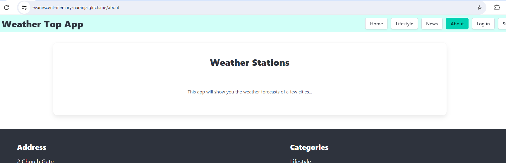

# Web Development Template

A starter project for learning web development created by John Rellis (SETU, Waterford, Ireland) was utilized to implement this project.

This is an Express.js project, designed to work well with the Glitch development environment. It includes basic express setup, handlebars templating, routing, + lowdb database.

This template is prepared in support of [Web Development II](https://next.tutors.dev/course/web-dev-2-2023) module in the [Higher Diploma in Computing](https://reader.tutors.dev/course/wit-hdip-comp-sci-showcase.netlify.app) at [SETU](https://www.setu.ie/), Ireland.

// This file has been created via https://markdownlivepreview.com/ //

# SETU-Web-Development 2

This is a website App created to be submitted as a second Web Development 2 assignment for [SETU](https://www.setu.ie/), Ireland.

# Weather Top App

This website is about implementing a weather station app using:

- Javascript
- Express/Handlebars
- [Glitch](https://glitch.com/)

whose data can be manually submitted by a user, or can be automatically generated by retrieving data via an integrated API https://api.openweathermap.org/data/2.5/weather call ([Weather API](https://openweathermap.org/api)) .

# What this project does

Its purpose is simply to show weather data of the cities manually added by the user via a [Bulma form](https://bulma.io/documentation/form/) from their Dashboard once they have signed up for an account and loggedin.

In a nutshell, data shown on the website Dashboard reflect the most up-to-date weather data of the inputted city, whereas the Station View also shows a report, which can be the historical weather data of the same city.
Upon logging in on 'Weather Top App', the user will be prompted to fill out a form to add a city and its geocoordinates. They will, then, be presented with 5 cards containing fields to be filled in with weather data and, 2 CTAs:

- one will take the user to the Station view in which weather data reports can be generated;
- one delete the station added.

# Why the project is useful

The project is useful for those users that would like to check the current weather data and also have their trend chart. However, the main purpose of the project was for the writer to be exposed to the use of Bulma components, Javascript, Express/Handlebars, node.js, and Glitch.

The ultimate idea here would have also been to expand the website insofar that it would have included a map showing markers on the geocoordinates of the cities added by the user to the Dashboard view.

However, being still technically challenged at this stage I decided not to pursue such objective after several failed attempts.

# How users can get started with the project

## Home page

As a user opens up the Weather Top App Homepage, they will see a sticky nav bar on the top for an easy navigation through the website.

### Navigation bars

The Navbars show all items that the user needs for a comfortable and friendly navigation.
The **welcome-menu.hbs** partial is the one that the user will see in the 'log out' state (also contains the logo, which is clickable and links to the Homepage 'index.hbs'.):,

https://cdn.glitch.global/017ec7e4-259a-40bb-8f25-d57df7ca2a07/image.png?v=1721594368037

whereas the **menu.hbs** one is what the user will see in their loggedin state, which contain less items (also contains the logo, which is clickable and links to the Homepage 'dashboard.hbs'.):


also contains the logo, which is clickable and links to the Homepage/Dashboard 'index.njk'.

#### Source attribution

Apart from the lecturer examples in the lab, the official bulma documentation in: \*https://bulma.io/documentation/components/navbar/

### Weather Icon cards Grid

As the user scrolls down, they will bump into a paraghraph inviting the user to log in or sign up, right above a grid made up of Bulma cards with OpenWeather icons https://openweathermap.org/weather-conditions:


This is just a nice, easy on the eye grid to get the user familiarized with the weathre conditions icons.

The layout has been achieved by using Bulma classes such as 'columns' to create a container for the columns embedded in it such as the 'column' class.

#### Source attribution

https://bulma.io/documentation/columns/basics/
https://bulma.io/documentation/components/card/#examples

All icons/images have been taken from:
https://openweathermap.org/weather-conditions

### Footer

At the bottom of the page, there is a footer (**footer.hbs** partial), with a 2 column layout.
While the first column shows an Irish address, the column on the right shows nav items/links.
Additionally, there is an underfooter with the 'Weather Top App' clickable logo to boost brand awareness and a string with the developer Linkedin link.


#### Source attribution

https://bulma.io/documentation/layout/footer/

## Lifestyle page

#### (\*This page is part of the previous assignment web-dev 1)

This page is basically a blog embedded into the website and users can supposedly use the search bar on the top to search for a tourist destination (I found it interesting to combine the 2 subjects).
It shows a variegated layout (**lifestyle-view.hbs**).

### Search Bar


### Destinations Video

This has been achieved by using a Bulma image component embedded into a 'box' class and a Youtube video is, in turn, embedded into it.


### Blog

This is a 4 column layout section made of 4 Bulma cards with images.
At the bottom of each card, there is a 'Read more' CTA, but it is 'performative' as the link gets the user back to the dashboard.


### Things to do

Here, the only difference with the above section is the 3 column layout.


#### Source attribution

https://bulma.io/documentation/elements/box/
https://bulma.io/documentation/elements/image/#arbitrary-ratios-with-any-

All images have been taken from:
https://pixabay.com/ and used availing of the URLs created in https://imgbb.com/ .

## News

This page is supposed to be a 'news' page to get travelers up to speed with the latest about tourist destinations (**news-view.hbs**)..


#### Source attribution

https://bulma.io/documentation/elements/box/

All images have been taken from:
https://pixabay.com/ used availing of the URLs created in https://imgbb.com/ .

## About page

This is just a simple and plain page with a centered copy (header and paraghraph, **about-view.hbs**) contained in a class 'box':



## Log in

The 'Log in' page is a 2 column layout with a Bulma form on the left column and a decorative image on the right one (**login-view**):


It is routed as per the below line of code in **routes.js**

```
router.get("/login", accountsController.login);
```

and its view is rendered by the **\*accounts-controller.js**

```
 /* The below 'login' action is invoked when "/login" route is triggered (user must be 'logged out').
 'render' passes the object 'viewData' */
  login(request, response) {
    const viewData = {
      title: "Login to the Service | Weather Top App",
    };
    response.render("login-view", viewData);
  },
er.get("/login", accountsController.login);
```

Once the user prompts the log in action, their data will be authenticated via the below action 'authenticate()':

```
 /* The below 'authenticate' action is invoked when "/authenticate" route is triggered */
  async authenticate(request, response) {
    // Discovering which user is logged in by retrieving theor email.
    const user = await userStore.getUserByEmail(request.body.email);
    if (user) {
      // The cookie 'station' will be created and will contain the user's email
      response.cookie("station", user.email);
      console.log(`logging in ${user.email}`);
      response.redirect("/dashboard");
    } else {
      // If the email is not recognized, the user will be prompted to make another log in attempt
      response.redirect("/login");
    }
  },

  // Utility method to check wether the user exists and which user owns it
  async getLoggedInUser(request) {
    const userEmail = request.cookies.station;
    return await userStore.getUserByEmail(userEmail);
  },
```

#### Source attribution

Image taken from:
https://pixabay.com

## Sign up


It is routed as per the below line of code in **routes.js**

```
router.get("/signup", accountsController.signup);
```

and its view is rendered by the **\*accounts-controller.js**

```
 /* The below 'signup' action is invoked when "/signup" route is triggered to create a new account
 'render' passes the object 'viewData' */
  signup(request, response) {
    const viewData = {
      title: "Sign up to the Service | Weather Top App",
    };
    response.render("signup-view", viewData);
  },
```

Once the user prompts the sign up action, their data will be registered via the below action 'register()' to create a new user:

```
  /* The below 'register' action is invoked when "/register" route is triggered */
  async register(request, response) {
    // The 'user' object is passed through to the function addUser() from the user-store.js and a new user is added
    const user = request.body;
    await userStore.addUser(user);
    console.log(`registering ${user.email}`);
    response.redirect("/");
  },
```

The user data will, then, be stored into **user-store.js** model and viewable in the generated **user.json** file, and a unique 'id' is created with them:

```
"firstName": "test",
      "lastName": "test",
      "email": "test",
      "password": "test",
      "_id": "98bc7ad5-a964-4ff8-a102-cded2aebc0ee"
```

As seen above, once the user signs up, they will be redirected to the homepage:

```
response.redirect("/");
```

and will have to click on 'Log In' on the menu if they would like to get access to the logged in views.

#### Source attribution

Image taken from:
https://pixabay.com

## Dashboard

Once the user logs in, they will land to their dashboard (**dashboard-view.hbs**):


As seen above, there is a Bulma form to add a station/city and its coordinates with a button.
A short line with a link opening to a new tab on LatLong.net has been added to help the user find the coordinates of the city they wish to check the weather conditions of.
The rationale behind that is that I wanted to let the user add manual reports in the Station View and be able to use accurate coordinates that match with those rendered by the integrated API https://api.openweathermap.org/data/2.5/weather call.

After getting the form (**add-station.hbs** partial) filled out and submitted

```
<form class="box" action="/dashboard/addstation" method="POST">
```

5 Bulma Cards are shown with icons and data to be fed into (**list-stations.hbs**)


The Dahboard view is rendered in the **dashboard-controllers.js**

```
  /* The below 'index' action is invoked when "/dashboard" route is triggered (user must be 'logged in').
 'render' passes the object 'viewData' */
  async index(request, response) {
    // Discovering which user is logged in by retrieving data from the model 'user-store.js'.
    const loggedInUser = await accountsController.getLoggedInUser(request);
    // Discovering which stations are stored in the station-store.js and associated to that specific user.
    const stations = await weatherStation.getStationsByUserId(loggedInUser._id);
     // The 'sortedStations' object invokes a method contained in the 'weatherstationAnalytics' utility to sort the stations in alhabetical order
    const sortedStations = weatherstationAnalytics.getSortedStations(stations);
    const viewData = {
      title: "Forecast Stations Dashboard | Weather Top App",
      stations: sortedStations,
    };
    // If user known, it creates a cookie called 'weathertop' containing the loggedin user 'id'
    console.log("dashboard rendering");
    response.cookie("weathertop", loggedInUser._id);
    response.render("dashboard-view", viewData);
  },
```

and it is routed via the below lcode line

```
router.get("/dashboard", dashboardController.index);
```

As the user clicks on the leftmost icon right below the cards, they will be redirected to the Station View page.

The action to add or delete station can be observed in the above-mentioned controller:

```
/* The below 'addStation' action is invoked when "/dashboard/addstation" route is triggered (user must be 'logged in'). */
  async addStation(request, response) {
    // Discovering which user is logged in by retrieving the data from the model 'user-store.js'.
    const loggedInUser = await accountsController.getLoggedInUser(request);
    // Creating object 'newStation' to pass data inputted by the user
    const newStation = {
      title: request.body.title,
      latitude: request.body.latitude,
      longitude: request.body.longitude,
      userid: loggedInUser._id,
    };
    console.log(`adding station ${newStation.title}`);
    // The function 'addStation()' in station-store.js' will add the new station
    await weatherStation.addStation(newStation);
    response.redirect("/dashboard");
  },

  /* The below 'deleteStation' action is invoked when "/dashboard/deletestation/:id" route is triggered (user must be 'logged in'). */
  async deleteStation(request, response) {
    // The object stationId will pass the station id to delete
    const stationId = request.params.id;
    console.log(`Deleting Station ${stationId}`);
    // The function deleteStationById() is invoked from the model station-store.js file
    await weatherStation.deleteStationById(stationId);
    response.redirect("/dashboard");
  },
```

and the model that stores station data is **station-store.js**, which, in turn, generates the **station.json** file.
Whenever a new station is added, the user id is listed in the json file along with the station id just created:

```
title": "Austin",
      "latitude": "30.2711286",
      "longitude": "-97.7436995",
      "userid": "1ccd6a07-13bb-4d99-88de-80863a4346aa",
      "_id": "c607cf56-eea5-48ec-bce3-0c7641bb72bf"
```

Noteworthy is the method used to get the stations sorted by alphabetical order once the user adds more than one station.

```
const sortedStations = weatherstationAnalytics.getSortedStations(stations);
```

which gets imported from the 'utils' file **weatherstations-analytics.js**

```
getSortedStations(stations) {
    let sortedStations = stations.sort((a, b) => a.title.localeCompare(b.title));
    console.log(stations);
    return sortedStations;
 },
```

All methods to import data from the Station view to feed the dashboard 5 cards with the latest weather conditions of the added stations are in the **dashboard-analytics.js**.

#### Source attribution

https://bulma.io/documentation/components/card/

https://www.flaticon.com/

Sorted stations method https://www.youtube.com/watch?v=CTHhlx25X-U

Broken icon styling method in https://dev.to/stephenafamo/the-best-way-to-style-broken-images-29k

//------------ Right card Daily Weather---------------------------//

let iconWindDaily = "unknown";

if (currentCityData.daily.weather_code[indexOfToday] === 0) {
iconWindDaily = '/images/gust.png';
} else if ((currentCityData.daily.weather_code[indexOfToday] >= 1) && (currentCityData.daily.weather_code[indexOfToday] <= 3)) {
iconWindDaily = '/images/windy.png';
} else {
iconWindDaily = '/images/sun.png';
}

```


### Modal

The modal is shown after clicking on the button 'Check more forecasts':


It has been used to shown some more dayly data and not to clutter up the page with an excessive amount of it as it is already showing quite a bit of information.
To nicely present the data to the user, a table element has been used.


#### Source attribution

The Javascript to make this modal work has been taken from here:

https://www.geeksforgeeks.org/bulma-modal/


### Daily Hourly Forecasts section

This 7 column section layout has been achieved by using a plain class 'column' which has filled the 'columns' container with equally-sized columns.


This is an interesting section as each element of these cards is dynamic.
The Header for instance is a day name and changes according to the current date. I was able to achieve this by using the functions below which I got from an online source and refactored to adapt it to my project scope:

```

// The below function gets the name of the current day out of variable 'date'

function getDayName(date = new Date(), locale = 'en-US') {
return date.toLocaleDateString(locale, {weekday: 'long'});
}

```

```

// The below function will enable the incrementation of the current day of a unit each time

function getDayTodayPlusOne(date = new Date()) {
const dateCopy = new Date(date.getTime());

      const todayPlusOne = new Date(
        dateCopy.setDate(
          dateCopy.getDate() + 1,
        ),
      );
      return todayPlusOne;
     }

      function getDayTodayPlusTwo(date = new Date()) {
        const dateCopy = new Date(date.getTime());

        const todayPlusTwo = new Date(
          dateCopy.setDate(
            dateCopy.getDate() + 2,
          ),
        );

      return todayPlusTwo;
     }

     function getDayTodayPlusThree(date = new Date()) {
      const dateCopy = new Date(date.getTime());

      const todayPlusThree = new Date(
        dateCopy.setDate(
          dateCopy.getDate() + 3,
        ),
      );

     return todayPlusThree;
     }

     function getDayTodayPlusFour(date = new Date()) {
     const dateCopy = new Date(date.getTime());

     const todayPlusFour = new Date(
      dateCopy.setDate(
        dateCopy.getDate() + 4,
      ),
     )

     return todayPlusFour;
     }

     function getDayTodayPlusFive(date = new Date()) {
     const dateCopy = new Date(date.getTime());

     const todayPlusFive = new Date(
      dateCopy.setDate(
        dateCopy.getDate() + 5,
      ),
     );

     return todayPlusFive;
     }

     function getDayTodayPlusSix(date = new Date()) {
     const dateCopy = new Date(date.getTime());

     const todayPlusSix = new Date(
      dateCopy.setDate(
        dateCopy.getDate() + 6,
      ),
     );

     return todayPlusSix;
     }

```

I then created an array of functions and iterated them through a forEach loop:

```

// Array of day name functions
let currentDays= [
getDayName(),
getDayName(getDayTodayPlusOne()),
getDayName(getDayTodayPlusTwo()),
getDayName(getDayTodayPlusThree()),
getDayName(getDayTodayPlusFour()),
getDayName(getDayTodayPlusFive()),
getDayName(getDayTodayPlusSix())
];

// Iterating the day name functions with forEach loop
currentDays.forEach((currentDay, index) => {

const cityFocusDayHeading = document.querySelector(`#cityfocus-${index + 1}-heading`);
cityFocusDayHeading.innerHTML = currentDay;

});

```

The rest of the hourly data (icon, temperature above 2 meters and apparent temperature) also change every hour.

The code in the 'city-focus.njk' page does not seem to be following the DRY principle, unfortunately, but, after days of failed attempts to reproduce what I learned through the lectures and labs, namely the layered JavaScript architecture - MVC, I decided to move on.
However, the page does seem to work as expected as per the assignment requirements.

This section's HTML is in the 'city-forecasts.njk' partial.


#### Source attribution


Name of the days:
https://bobbyhadz.com/blog/javascript-get-day-name-from-date

Incrementing days:
https://bobbyhadz.com/blog/javascript-get-date-of-next-monday


### Go back to the (Whether) Weather Dashboard !

This component is a card embedded in a 'container' followed by a 'columns' class and it is in the 'back-to-dashboard.njk' partial.


Its purpose is just to give the user another option to get back to the Dashboard.

## Settings page

This page was meant to be a preferences user interface where preferences were saved in a Local Storage, but, unfortunately, due to time constraints as well as the fact that I did not utilize a Layered JavaScript Architecture, I could not get this step completed.


In a nutshell, the page layout is a three column one ("column-is-4" class) and added 2 cards with labels class="checkbox".

Unfortunately, this is just a static page with no use for a user at this time.


# Contact info

Users can contact me at andrea.nardinocchi76@gmail.com or by clicking on the website underfoot where they can find my name linking to my Linkedin profile.

# Who maintains and contributes to the project

This project will be maintained by myself only.

# Acknowledgements

My lecture John Rellis provided all info I needed to build and set up the pages by transferring knowledge of programming/web-development languages and tools such as HTML, Bulma CSS framework, Javascript, Netlify, Nunjucks, Eleventy.

Special thanks to John Rellis again, Giovanni and David O'Connor who came to my rescue when I was stuck at some point and was failing to move the needle with showing 'dynamically' the hourly data on the days of the 'Dayly Hourly Forecasts section'.

Without them, this project would have been a failure. Thank you again!!!
```
