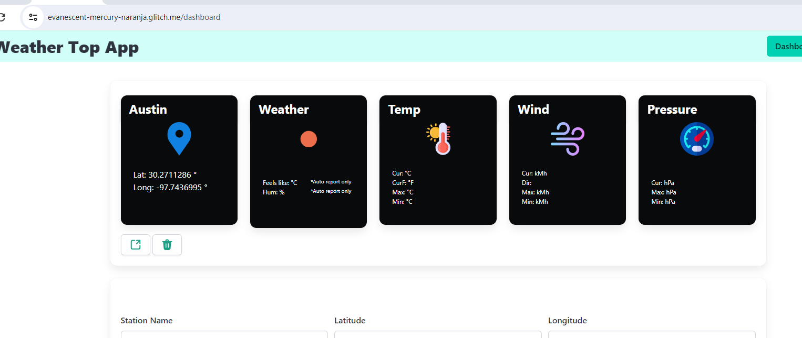
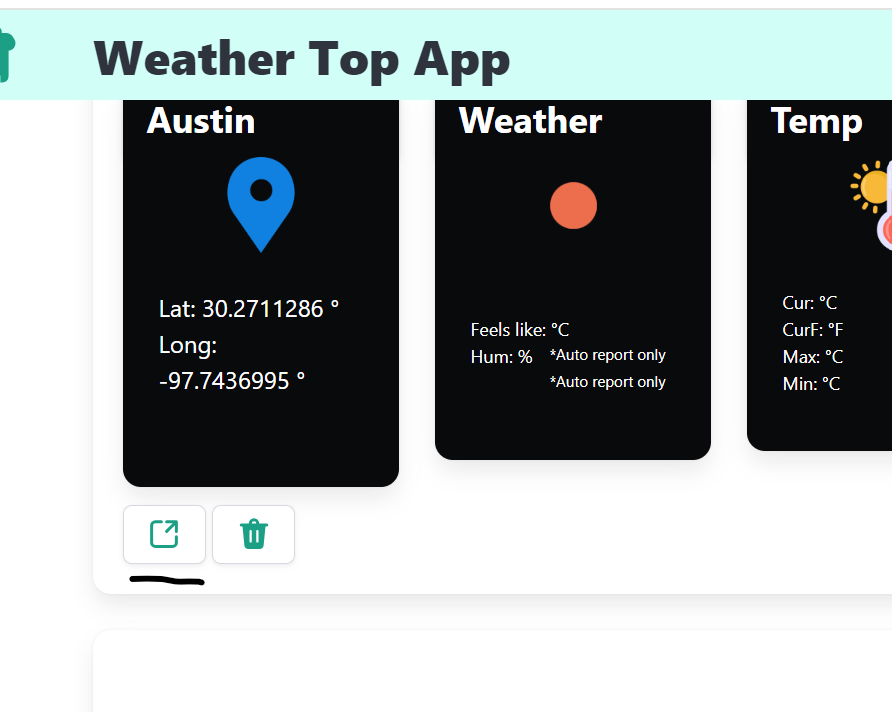

# Web Development Template

A starter project for learning web development created by John Rellis (SETU, Waterford, Ireland) was utilized to implement this project.

This is an Express.js project, designed to work well with the Glitch development environment. It includes basic express setup, handlebars templating, routing, + lowdb database.

This template is prepared in support of [Web Development II](https://next.tutors.dev/course/web-dev-2-2023) module in the [Higher Diploma in Computing](https://reader.tutors.dev/course/wit-hdip-comp-sci-showcase.netlify.app) at [SETU](https://www.setu.ie/), Ireland.


// This file has been created via https://markdownlivepreview.com/ //

# SETU-Web-Development 2
This is a website App created to be submitted as a second Web Development 2 assignment for [SETU](https://www.setu.ie/), Ireland.

# Weather Top App
This website is about implementing a weather station app using:
- Javascript
- Express/Handlebars
- + lowdb database
- [Glitch](https://glitch.com/) 

whose data can be manually submitted by the user, or can be automatically generated by retrieving data via an integrated API https://api.openweathermap.org/data/2.5/weather call ([Weather API](https://openweathermap.org/api)) .

# What this project does
Its purpose is simply to show weather conditions data of the weather stations/cities manually added by the user via a [Bulma form](https://bulma.io/documentation/form/) from their Dashboard, once they have signed up for an account and logged in.

In a nutshell, data shown on the website Dashboard reflect the most up-to-date weather conditions data of the inputted station/city, whereas the Station View also shows a report, which can be the historical weather conditions data of the station/city itself
. 
Upon logging in on 'Weather Top App', the user will be prompted to fill out a form to add a weather station/city and its geocoordinates. They will, then, be presented with 5 cards containing fields to be filled in with weather conditions data and, 2 CTAs:
- one will take the user to the Station view in which weather data reports can be generated;
- one delete the station/city from the Dashboard View.

# Why the project is useful
The project is useful for those users that would like to check the current weather conditions data, and also would like to get a temperature trend chart. However, the main purpose of the project was for the writer to be exposed to the use of Bulma components, Javascript, Express/Handlebars, node.js, lowdb database, and Glitch.

The ultimate idea here would have also been to expand the website insofar that it would have included a map showing markers on the geocoordinates of the stations/cities added by the user to the Dashboard view.

However, being still technically challenged at this stage, I decided not to pursue such objective after several failed attempts.

# How users can get started with the project

## Home page

As a user opens up the **Weather Top App Homepage**, they will see a sticky nav bar on the top for an easy navigation through the website.

### Navigation bars

The Navbars show all items that the user needs for a comfortable and friendly navigation. 
The **welcome-menu.hbs** partial is the one that the user will see in the 'log out' state (also contains the logo, which is clickable and links to the Homepage **index.hbs**.):,


whereas the **menu.hbs** one is what the user will see in their loggedin state, which contain less items (also contains the logo, which is clickable and links to the Dashboard view **dashboard.hbs**.):


 Last, but not least, the navbar is responsive and mobile-friendly:

   


#### Source attribution

Apart from the lecturer examples in the lab, the official bulma documentation in:
https://bulma.io/documentation/components/navbar/

I also studied some examples online such as https://www.geeksforgeeks.org/bulma-navbar/.


### Weather Icon cards Grid

As the user scrolls down, they will bump into a paragraph inviting the user to log in or sign up, right above a grid made up of Bulma cards with OpenWeather icons https://openweathermap.org/weather-conditions:


This is just a nice, easy on the eye grid to get the user familiarized with the weathre conditions icons.

The layout has been achieved by using Bulma classes such as 'columns' to create a container for the columns embedded in it such as the 'column' class.

#### Source attribution

https://bulma.io/documentation/columns/basics/
https://bulma.io/documentation/components/card/#examples

All icons/images have been taken from:
https://openweathermap.org/weather-conditions


### Footer

At the bottom of the page, there is a footer (**footer.hbs** partial), with a 2 column layout.
While the first column shows an Irish address, the column on the right shows nav items/links.
Additionally, there is an underfooter with the 'Weather Top App' clickable logo to boost brand awareness and a string with the developer Linkedin link.


#### Source attribution

https://bulma.io/documentation/layout/footer/

## Lifestyle page 
#### (*This page is part of the previous assignment web-dev 1)

This page is basically a blog embedded into the website and users can supposedly use the search bar on the top to search for a tourist destination (I found it interesting to combine the 2 subjects).
It shows a variegated layout (**lifestyle-view.hbs**).

### Search Bar


### Destinations Video

This has been achieved by using a Bulma image component embedded into a 'box' class and a Youtube video is, in turn, embedded into it.


### Blog
This is a 4 column layout section made of 4 Bulma cards with images.
At the bottom of each card, there is a 'Read more' CTA, but it is 'performative' as the link gets the user back to the dashboard.


### Things to do
Here, the only difference with the above section is the 3 column layout.


#### Source attribution

https://bulma.io/documentation/elements/box/
https://bulma.io/documentation/elements/image/#arbitrary-ratios-with-any-

All images have been taken from:
https://pixabay.com/ and used availing of the URLs created in https://imgbb.com/ .


## News

(*This page is part of the previous assignment web-dev 1)

This page is supposed to be a 'news' page to get travelers up to speed with the latest about tourist destinations (**news-view.hbs**).


#### Source attribution

https://bulma.io/documentation/elements/box/

All images have been taken from:
https://pixabay.com/ used availing of the URLs created in https://imgbb.com/ .


## About page

This is just a simple and plain page with a centered copy (header and paraghraph, **about-view.hbs**) contained in a class 'box':


## Log in

The 'Log in' page is a 2 column layout with a Bulma form on the left column and a decorative image on the right one (**login-view**):


It is routed as per the below line of code in **routes.js** 

```
router.get("/login", accountsController.login);
```
and its view is rendered by the ***accounts-controller.js**

```
 /* The below 'login' action is invoked when "/login" route is triggered (user must be 'logged out').
 'render' passes the object 'viewData' */ 
  login(request, response) {
    const viewData = {
      title: "Login to the Service | Weather Top App",
    };
    response.render("login-view", viewData);
  },
er.get("/login", accountsController.login);
```
Once the user prompts the log in action, their data will be authenticated via the below action 'authenticate()':

```
 /* The below 'authenticate' action is invoked when "/authenticate" route is triggered */ 
  async authenticate(request, response) {
    // Discovering which user is logged in by retrieving theor email.
    const user = await userStore.getUserByEmail(request.body.email);
    if (user) {
      // The cookie 'station' will be created and will contain the user's email
      response.cookie("station", user.email);
      console.log(`logging in ${user.email}`);
      response.redirect("/dashboard");
    } else {
      // If the email is not recognized, the user will be prompted to make another log in attempt
      response.redirect("/login");
    }
  },

  // Utility method to check wether the user exists and which user owns it
  async getLoggedInUser(request) {
    const userEmail = request.cookies.station;
    return await userStore.getUserByEmail(userEmail);
  },   
```

#### Source attribution

Image taken from:
https://pixabay.com

## Sign up


It is routed as per the below line of code in **routes.js** 

```
router.get("/signup", accountsController.signup);
```
and its view is rendered by the ***accounts-controller.js**

```
 /* The below 'signup' action is invoked when "/signup" route is triggered to create a new account
 'render' passes the object 'viewData' */ 
  signup(request, response) {
    const viewData = {
      title: "Sign up to the Service | Weather Top App",
    };
    response.render("signup-view", viewData);
  },
```
Once the user prompts the sign up action, their data will be registered via the below action 'register()' to create a new user:

```
  /* The below 'register' action is invoked when "/register" route is triggered */ 
  async register(request, response) {
    // The 'user' object is passed through to the function addUser() from the user-store.js and a new user is added
    const user = request.body;
    await userStore.addUser(user);
    console.log(`registering ${user.email}`);
    response.redirect("/");
  },
```

The user data will, then, be stored into **user-store.js** model and viewable in the generated **user.json** file, and a unique 'id' is created with them:
```
"firstName": "test",
      "lastName": "test",
      "email": "test",
      "password": "test",
      "_id": "98bc7ad5-a964-4ff8-a102-cded2aebc0ee"
```

As seen above, once the user signs up, they will be redirected to the homepage:
```
response.redirect("/");
```
and will have to click on 'Log In' on the menu if they would like to get access to the logged in views.

#### Source attribution

Image taken from:
https://pixabay.com


## Dashboard

Once the user logs in, they will land to their dashboard (**dashboard-view.hbs**):


As seen above, there is a Bulma form to add a station/city and its coordinates with a button.
A short line with a link opening to a new tab on LatLong.net has been added to help the user find the coordinates of the city they wish to check the weather conditions of.
The rationale behind that is that I wanted to let the user add manual reports in the Station View and be able to use accurate coordinates that match with those rendered by the integrated API https://api.openweathermap.org/data/2.5/weather call.

After getting the form (**add-station.hbs** partial) filled out and submitted
```
<form class="box" action="/dashboard/addstation" method="POST">
```
5 Bulma Cards are shown with icons and data to be fed into (**list-stations.hbs**)



The Dahboard view is rendered in the **dashboard-controllers.js**
```
  /* The below 'index' action is invoked when "/dashboard" route is triggered (user must be 'logged in').
 'render' passes the object 'viewData' */ 
  async index(request, response) {
    // Discovering which user is logged in by retrieving data from the model 'user-store.js'.
    const loggedInUser = await accountsController.getLoggedInUser(request);
    // Discovering which stations are stored in the station-store.js and associated to that specific user.
    const stations = await weatherStation.getStationsByUserId(loggedInUser._id);
     // The 'sortedStations' object invokes a method contained in the 'weatherstationAnalytics' utility to sort the stations in alhabetical order
    const sortedStations = weatherstationAnalytics.getSortedStations(stations); 
    const viewData = {
      title: "Forecast Stations Dashboard | Weather Top App",
      stations: sortedStations,
    };
    // If user known, it creates a cookie called 'weathertop' containing the loggedin user 'id'
    console.log("dashboard rendering");
    response.cookie("weathertop", loggedInUser._id);
    response.render("dashboard-view", viewData);
  },
```
and it is routed via the below code line
```
router.get("/dashboard", dashboardController.index);
```
As the user clicks on the leftmost icon right below the cards, they will be redirected to the Station View page.

The action to add or delete station can be observed in the above-mentioned controller:
```
/* The below 'addStation' action is invoked when "/dashboard/addstation" route is triggered (user must be 'logged in'). */
  async addStation(request, response) {
    // Discovering which user is logged in by retrieving the data from the model 'user-store.js'.
    const loggedInUser = await accountsController.getLoggedInUser(request);
    // Creating object 'newStation' to pass data inputted by the user 
    const newStation = {
      title: request.body.title,
      latitude: request.body.latitude,
      longitude: request.body.longitude,
      userid: loggedInUser._id,
    };
    console.log(`adding station ${newStation.title}`);
    // The function 'addStation()' in station-store.js' will add the new station
    await weatherStation.addStation(newStation); 
    response.redirect("/dashboard");
  },
 
  /* The below 'deleteStation' action is invoked when "/dashboard/deletestation/:id" route is triggered (user must be 'logged in'). */
  async deleteStation(request, response) {
    // The object stationId will pass the station id to delete
    const stationId = request.params.id;
    console.log(`Deleting Station ${stationId}`);
    // The function deleteStationById() is invoked from the model station-store.js file
    await weatherStation.deleteStationById(stationId);
    response.redirect("/dashboard");
  },
```
and the model that stores station data is **station-store.js**, which, in turn, generates the **station.json** file. 
Whenever a new station is added, the user id is listed in the json file along with the station id just created:
```
title": "Austin",
      "latitude": "30.2711286",
      "longitude": "-97.7436995",
      "userid": "1ccd6a07-13bb-4d99-88de-80863a4346aa",
      "_id": "c607cf56-eea5-48ec-bce3-0c7641bb72bf"
```
Noteworthy is the method used to get the stations sorted by alphabetical order once the user adds more than one station,
```
const sortedStations = weatherstationAnalytics.getSortedStations(stations);
```
which gets imported from the 'utils' file **weatherstations-analytics.js** 
```
getSortedStations(stations) {
    let sortedStations = stations.sort((a, b) => a.title.localeCompare(b.title));
    console.log(stations);
    return sortedStations;
 },
```
All methods to import data from the Station view to feed the dashboard 5 cards with the latest weather conditions of the added stations are in the **dashboard-analytics.js**. However, since these methods are importing data from the Station view and since the handlebars 'expressions' used in the **list-station.hbs** partial are iterated through an '{{#each stations}}' loop, a 'getStationData(station)' was created to retrieve the 'properties' of the 'stations' array as seen in https://stackoverflow.com/questions/6439915/how-to-set-a-javascript-object-values-dynamically/6439954#6439954 .

```
  /* The method getStationData(station); is basically the same method as the reportStore.updateReport() one and 
  will make the latest station details show on the dashboard view (passing them through to the latter). 
  https://stackoverflow.com/questions/6439915/how-to-set-a-javascript-object-values-dynamically/6439954#6439954 */
  async getStationData(station) {
    // Retrieving the below object values/data from report-store.js 
    const reports = await reportStore.getReportsByStationId(station._id);
    if (reports.length > 0) {
      const temperature = dashboardAnalytics.getTemperature(station);
      const feelsLike = dashboardAnalytics.getFeelsLike(station);
      const humidity = dashboardAnalytics.getHumidity(station);
      const tempFar = dashboardAnalytics.getTempFar(station);
      const maxTemp = dashboardAnalytics.getMaxTemp(station);
      const minTemp = dashboardAnalytics.getMinTemp(station);
      const wind = dashboardAnalytics.getWind(station);
      const windDirect = dashboardAnalytics.getWindDirect(station);
      const windDir = dashboardAnalytics.getWindDir(station);
      const maxWindSpeed = dashboardAnalytics.getMaxWindSpeed(station);
      const minWindSpeed = dashboardAnalytics.getMinWindSpeed(station);
      const pressure = dashboardAnalytics.getPressure(station);
      const maxPressure = dashboardAnalytics.getMaxPressure(station);
      const minPressure = dashboardAnalytics.getMinPressure(station);
      const iconCode = dashboardAnalytics.getIconCode(station);
      const weatherType = dashboardAnalytics.getWeatherType(station);
      // Creating a new object 'newStation' and retrieving values 
      const newStation = {};
      newStation['temperature'] = temperature;
      newStation['feelsLike'] = feelsLike;
      newStation['humidity'] = humidity;
      newStation['tempFar'] = tempFar;
      newStation['maxTemp'] = maxTemp;
      newStation['minTemp'] = minTemp;
      newStation['wind'] = wind;
      newStation['windDirect'] = windDirect;
      newStation['windDir'] = windDir;
      newStation['maxWindSpeed'] = maxWindSpeed;
      newStation['minWindSpeed'] = minWindSpeed;
      newStation['pressure'] = pressure;
      newStation['maxPressure'] = maxPressure;
      newStation['minPressure'] = minPressure;
      newStation['iconCode'] = iconCode;
      newStation['weatherType'] = weatherType;
      console.log(newStation + iconCode);
      console.log("Updating station data for " + station.title);
      /* The below action calls a new method 'weatherStation.updateStationDetails' and passes 
      both the original stations and the updated ones into the station-store.js model, which then
      will enable the dashboard-view to render them */
      weatherStation.updateStationDetails(station, newStation);
   }
  }
```

#### Source attribution

https://bulma.io/documentation/components/card/

https://www.flaticon.com/

Sorted stations method https://www.youtube.com/watch?v=CTHhlx25X-U

Broken icon styling method in https://dev.to/stephenafamo/the-best-way-to-style-broken-images-29k on **list-station.hbs**

https://stackoverflow.com/questions/6439915/how-to-set-a-javascript-object-values-dynamically/6439954#6439954 


## Station

The Station view is the page where the user lands on when clicking on the leftmost CTA, right below the 5 cards in the Dashboard view.




```
  <a href="/station/{{_id}}" class="button">
  {{>icons/open}}
```


The Station view in **station-view.hbs** is rendered by the 'index' action in the **station-controller.js** file:

```
async index(request, response) {
    // Discovering the station by its id by retrieving data from the model 'station-store.js'.
    const station = await weatherStation.getStationById(request.params.id);
    // The below action will call out the method getStationData(station); from the 'weatherStation' utility.
    await weatherstationAnalytics.getStationData(station);
    /* Creating new object by calling out methods from 'station-analytics.js' utility. 
    All of them will be called in in the 'handlebars' via 'expressions' ({{}}) */
    const temperatureReport = stationAnalytics.getTemperatureReport(station);
    const tempFarReport = stationAnalytics.getTempFarReport(station);
    const maxTempReport = stationAnalytics.getMaxTempReport(station);
    const minTempReport = stationAnalytics.getMinTempReport(station);
    const maxWindSpeedReport = stationAnalytics.getMaxWindSpeedReport(station);
    const minWindSpeedReport= stationAnalytics.getMinWindSpeedReport(station);
    const windDirection = stationAnalytics.getWindDirectionReport(station);
    const windDir = stationAnalytics.getWindDir(station);
    const windReport = stationAnalytics.getWindReport(station);
    const pressureReport = stationAnalytics.getPressureReport(station);
    const maxPressureReport = stationAnalytics.getMaxPressureReport(station);
    const minPressureReport = stationAnalytics.getMinPressureReport(station);
    const iconCodeReport = stationAnalytics.getIconCodeReport(station);
    const weatherTypeReport = stationAnalytics.getWeatherTypeReport(station);
    const feelsLikeReport = stationAnalytics.getFeelsLikeReport(station);
    const humidityReport = stationAnalytics.getHumidityReport(station);
    const viewData = {
      title: "Station View | Weather Top App",
      station: station,
      temperatureReport: temperatureReport,
      tempFarReport: tempFarReport,
      maxTempReport: maxTempReport,
      minTempReport: minTempReport,
      windReport: windReport,
      maxWindSpeedReport: maxWindSpeedReport,
      minWindSpeedReport: minWindSpeedReport,
      windDirection: windDirection,
      windDir: windDir,
      pressureReport: pressureReport,
      maxPressureReport: maxPressureReport,  
      minPressureReport: minPressureReport,
      iconCodeReport: iconCodeReport,
      weatherTypeReport: weatherTypeReport,
      feelsLikeReport: feelsLikeReport,
      humidityReport: humidityReport,    
    };
    response.render("station-view", viewData);
  },

  ```

  As seen in the above code, const variables are created and import data from the functions, in turn, created in the **station-analytics.js** file in the 'utils' folder. The variables and the values (weather conditions data) of their methods populate the 5 cards of the station/city. 

  The weather conditions data are added through three different actions called in the **station-controller.js**:
  - addManualReport()
  - addAutoReport()
  - addChartReport()

  All of the actions above-listed call out their respective methods in the **report-store.js** in which the reports are stored and a reports.json is generated to list them all.

  #### addManualReport()
  ```
    /* The below 'addManualReport' action is invoked when "/station/:id/addmanualreport" route is triggered (user must be 'logged in'). */ 
  async addManualReport(request, response) {
    // Discovering which station is stored in the station-store.js and associated to that specific user.
    const station = await weatherStation.getStationById(request.params.id);
    // Passing data through to add a new report
    const newReport = {
      code: Number(request.body.code),
      temperature: Number(request.body.temperature),
      windSpeed: Number(request.body.windSpeed),
      windDirection: request.body.windDirection,
      windSpeed: Number(request.body.windSpeed),
      pressure: Number(request.body.pressure),
      currentHour: dayjs().format("YYYY-MM-DD HH:mm:ss") // Adding current time
    };
    console.log(`adding report ${newReport.code}`);
    // The below function addManualReport() is retrieved from the model report-store.js
    await reportStore.addManualReport(station._id, newReport);
    response.redirect("/station/" + station._id);
  },
```

This action enables the user to manually add station reports via the Bulma form and the **add-report.hbs** partial.

The manual and auto report can also be updated, via the Bulma form in the **edit-user.hbs** partial, triggered when clicking the 'edit icon':


The below edit page is rendered by the **report-controller.js**
```
/* The below 'index' action is invoked when "/station/:id" route is triggered (user must be 'logged in'). */
  async index(request, response) {
    // Passing 'station' and 'report' data through.
    const stationId = request.params.stationid;
    const reportId = request.params.reportid;
    console.log(`Editing Report ${reportId} from Station ${stationId}`);
    const viewData = {
      title: "Edit Station",
      // Stations and reports are rendered as retrieved from the model 'user-store.js' and 'report-store.js'.
      station: await weatherStation.getStationById(stationId),
      report: await reportStore.getReportById(reportId),
    };
    response.render("report-view", viewData);
  },
  ```


and routed by 
 
 ```
 router.post("/station/:stationid/updatereport/:reportid", reportController.update);
 ```

The action to get the report updated lives in the **report-controller.js** too
```
/* The below 'index' action is invoked when "/station/:stationid/editreport/:reportid" route is triggered (user must be 'logged in'). */
  async update(request, response) {
    // Passing 'station' and 'report' data through.
    const stationId = request.params.stationid;
    const reportId = request.params.reportid;
    // Creating object updatedReport to update report
    const updatedReport = {
      code: Number(request.body.code),
      temperature: Number(request.body.temperature),
      windSpeed: Number(request.body.windSpeed),
      windDirection: request.body.windDirection,
      windDir: request.body.windDir,
      windSpeed: Number(request.body.windSpeed),
      pressure: Number(request.body.pressure),
    };
    console.log(`Updating Report ${reportId} from Station ${stationId}`);
    // Retrieving the report to update from 'report-store,js'
    const report = await reportStore.getReportById(reportId);
    // The updateReport() function from 'report-store,js' will update the report
    await reportStore.updateReport(report, updatedReport);
    response.redirect("/station/" + stationId);
  },
```

Once the user edits the form field values and clicks on the CTA 'Update report', the action tag in the form in **edit-user.hbs** 
```
<form class="box" action="/station/{{station._id}}/updatereport/{{report._id}}" method="POST">
```
will trigger the response on the action updateReport() in **report-controller.js**, as shown above. At that point, the **report-store.js** will update the report data and show them on the **report.json** file

```
{
      "code": 200,
      "temperature": 34,
      "windSpeed": 78,
      "windDirection": "West-northwest (WNW)",
      "windDir": "20",
      "pressure": 45,
      "currentHour": "2024-07-22 18:07:28",
      "_id": "bd4639dd-024c-4aa3-8e4c-addbdac21e74",
      "stationid": "91bcb86d-9c07-4ac7-95cb-54c1915f8fdb"
    },
```

### addAutoReport()
```
/* The below 'addAutoReport' action is invoked when "/station/:id/addautoreport" route is triggered (user must be 'logged in'). 
  It would be basically the same action as the 'addChartReport', but for the chart the the TempTrend and TempLabels objects, which have not been included in here */ 
  async addAutoReport(request, response) {
    const station = await weatherStation.getStationById(request.params.id);
    console.log("rendering new report");
    const title = station.title;
    let report = {};
    const cityRequestUrl  = `https://api.openweathermap.org/data/2.5/weather?q=${title}&units=metric&appid=c3e26a0b5387b001f6f548f5710c0baf`;
    const cityResult = await axios.get(cityRequestUrl);
    if (cityResult.status == 200) {
      const currentWeather = cityResult.data;
      report.currentHour = dayjs().format("YYYY-MM-DD HH:mm:ss");
      report.title = currentWeather.name;
      report.longitude = currentWeather.coord.lon;
      report.latitude = currentWeather.coord.lat;
      report.code = currentWeather.weather[0].id;
      report.iconCodeReport = currentWeather.weather[0].icon;
      report.weatherTypeReport = currentWeather.weather[0].main;
      report.temperature = currentWeather.main.temp;
      report.tempFar = (currentWeather.main.temp* 1.8) + 32;
      report.maxTempReport = currentWeather.main.temp_max;
      report.minTempReport = currentWeather.main.temp_min;
      report.feelsLikeReport = currentWeather.main.feels_like;
      report.humidityReport = currentWeather.main.humidity;
      report.windSpeed = currentWeather.wind.speed;
      report.pressure = currentWeather.main.pressure;
      report.windDir = currentWeather.wind.deg;  
   }
    console.log(report);
    const viewData = {
      title: "Weather Autogenerated Report | Weather Top App",
      station: report,  
      currentHour: dayjs().format("YYYY-MM-DD HH:mm:ss") // Adding current time
    };
    // The function 'addAutoReport()' is retrieved from the model report-store.js
    await reportStore.addAutoReport(station._id, report);
    response.redirect("/station/" + station._id);
  },
```
This action enables the user to get an automated station report based upon an API call that returns weather stations conditions according to the added city name via the Bulma form and the **add-report.hbs** partial :

  

 The **report.json** offers a clear picture of the weather conditions data retrieved.

```
 {
      "currentHour": "2024-07-22 18:05:30",
      "title": "Phoenix",
      "longitude": -112.074,
      "latitude": 33.4484,
      "code": 801,
      "iconCodeReport": "02d",
      "weatherTypeReport": "Clouds",
      "temperature": 37.62,
      "tempFar": 99.716,
      "maxTempReport": 38.98,
      "minTempReport": 36.07,
      "feelsLikeReport": 39.12,
      "humidityReport": 31,
      "windSpeed": 3.58,
      "pressure": 1009,
      "windDir": 101,
      "_id": "fd8f31cd-1020-4689-8687-cadd97278979",
      "stationid": "5a04c321-cb35-4c4c-918f-6bc180e09cbc"
    },
```

### addChartReport()

```
/* The below 'addChartReport' action is invoked when "/station/:id/addchartreport" route is triggered (user must be 'logged in'). */ 
  async addChartReport(request, response) {
    // Discovering which station is stored in the station-store.js and associated to that specific user.
    const station = await weatherStation.getStationById(request.params.id);
    console.log("rendering new report");
    // Retrieving the object 'title' value from the getStationData(station) action in weatherstation-analytics.js
    const title = station.title;
    let report = {};
    // Creating a cityRequestUrl object to retrieve weather data straight from the API call based upon the city name (title) inputted by the user 
    const cityRequestUrl  = `https://api.openweathermap.org/data/2.5/weather?q=${title}&units=metric&appid=c3e26a0b5387b001f6f548f5710c0baf`;
    const cityResult = await axios.get(cityRequestUrl);
    if (cityResult.status == 200) {
      const currentWeather = cityResult.data;
      report.currentHour = dayjs().format("YYYY-MM-DD HH:mm:ss");
      report.title = currentWeather.name;
      report.longitude = currentWeather.coord.lon;
      report.latitude = currentWeather.coord.lat;
      report.code = currentWeather.weather[0].id;
      report.iconCodeReport = currentWeather.weather[0].icon;
      report.weatherTypeReport = currentWeather.weather[0].main;
      report.temperature = currentWeather.main.temp;
      report.tempFar = ((currentWeather.main.temp* 1.8) + 32).toFixed(2); //https://www.w3schools.com/howto/howto_js_format_number_dec.asp
      report.maxTempReport = currentWeather.main.temp_max;
      report.minTempReport = currentWeather.main.temp_min;
      report.feelsLikeReport = currentWeather.main.feels_like;
      report.humidityReport = currentWeather.main.humidity;
      report.windSpeed = currentWeather.wind.speed;
      report.pressure = currentWeather.main.pressure;
      report.windDir = currentWeather.wind.deg;   
   }
    // Retrieving the object 'latitude' and 'longitude' values from the getStationData(station) method in weatherstation-analytics.js
    const lng = station.longitude; 
    const lat = station.latitude;
    /* Creating a cityRequestUrl object to retrieve weather data straight from 
    the API call based upon the 'latitude' and 'longitude' inputted by the user */
    const latLongRequestUrl = `https://api.openweathermap.org/data/2.5/forecast?lat=${lat}&lon=${lng}&units=metric&appid=c3e26a0b5387b001f6f548f5710c0baf`;
    const latLongResult = await axios.get(latLongRequestUrl);
    if (latLongResult.status == 200) {
      report.tempTrend = [];
      report.trendLabels = [];
      const trends = latLongResult.data.list;
      for (let i=0; i<10; i++) {
        report.tempTrend.push(trends[i].main.temp);
        report.trendLabels.push(trends[i].dt_txt);
      }
   }
   console.log(report);
    const viewData = {
      title: "Weather Chart Report | Weather Top App",
      station: report,  
      currentHour: dayjs().format("YYYY-MM-DD HH:mm:ss") // Adding current time
    };
    /* A new 'stationreading' is created since I created 3 different (addManualReport, addAutoReport and addChartReport) methods in the 'report-store.js' model,
    and this one would not render in the station view for some reason */
    response.render("stationreading-view" , viewData);
  },
```
This action enables the user to get an automated station report with a temperature trend chart powered by Frappe based upon an API call that returns weather stations conditions according to the latitude and longitude added by the user via the Bulma form and the **add-report.hbs** partial :


Having said that, my original aim was to add a Temperature Trend chart to the same Station view routed in.
```
router.get("/station/:id", stationController.index);
```
However, I could not get the chart to render on the above-mentioned view for some reason that I evidently failed to understand.

The **report.json** offers a clear picture of the weather conditions data retrieved.

```
 "currentHour": "2024-07-21 09:35:28",
      "title": "Milan",
      "longitude": 9.1895,
      "latitude": 45.4643,
      "code": 800,
      "iconCodeReport": "01d",
      "weatherTypeReport": "Clear",
      "temperature": 28.65,
      "tempFar": 83.57,
      "maxTempReport": 29.65,
      "minTempReport": 27.66,
      "feelsLikeReport": 30.74,
      "humidityReport": 62,
      "windSpeed": 2.57,
      "pressure": 1010,
      "windDir": 160,
      "tempTrend": [
        33.63,
        36.33,
        36.08,
        33.63,
        33.21,
        30.79,
        29.55,
        33.94,
        37.74,
        38.05
      ],
      "trendLabels": [
        "2024-07-21 12:00:00",
        "2024-07-21 15:00:00",
        "2024-07-21 18:00:00",
        "2024-07-21 21:00:00",
        "2024-07-22 00:00:00",
        "2024-07-22 03:00:00",
        "2024-07-22 06:00:00",
        "2024-07-22 09:00:00",
        "2024-07-22 12:00:00",
        "2024-07-22 15:00:00"
      ],
      "_id": "708c99f2-4480-4ea5-8f73-a97fc13d83f8",
      "stationid": "649823c0-5cc8-4fa5-9271-39365fcd3c6e"
    },
```

#### Source attribution

https://frappe.io/charts

https://bulma.io/documentation/components/card/

https://www.flaticon.com/

https://stackoverflow.com/questions/15992085/html-select-drop-down-with-an-input-field

### Account


This page is where the user can check their personal details and update them via a Bulma form:


The **account-controller.hbs** renders the page through the below action

```
/* The below 'account' action is invoked when "/account" route is triggered and renders the user's data */ 
  async account(request, response) {
    const user = await accountsController.getLoggedInUser(request); 
    const firstName = user.firstName;
    const lastName = user.lastName;
    const email = user.email;
    const password = user.password;
    const _id = user._id;
      const viewData = {
        title: "Account",
        firstName: firstName,
        lastName: lastName,
        email: email,
        password: password,
        _id: _id,
      };
      response.render("account-view", viewData);
    },
```
and routed in

```
router.get("/account/", accountsController.account);
```
Once the user changes the form field values and clicks on the CTA 'Update User', the action into the form tag in **edit-user.hbs**  response 
```
<form class="box" action="/account/updateuser/" method="POST">
```
routed by
```
router.post("/account/updateuser/", accountsController.update);
```

will trigger a response put into action by the **accounts-controller.hbs** action below

```
 /* The below 'account' action is invoked when "/account/edituser/" route is triggered and updates the user's data */ 
  async update(request, response) {
    console.log(request.body);
    // Discovering which user is logged in by retrieving the data from them model 'user-store.js'.
    const user = await accountsController.getLoggedInUser(request);
    // Passing user data throught to the 'updateUser' object
    const firstName = request.body.firstName;
    const lastName = request.body.lastName;
    const email = request.body.email;
    const password = request.body.password;
    const _id = request.body._id;
    const updatedUser = {
      firstName: firstName,
      lastName: lastName,
      email: email,
      password: password,
      _id: user._id,
     };
    // The below 'updateUser()' function from the 'user-store.js' file will update the user's data
    await userStore.updateUser(user, updatedUser); 
    // The cookie 'station' will be created and will contain the user's email
    response.cookie("station", user.email, user.password); 
    console.log(`updating ${user.email}`);
    response.redirect("/login/"); 
  },
```
The function updateUser() in **user-store.hbs** will then help store the update user data 
```
  async updateUser(user, updatedUser) {
    user._id = updatedUser._id;
    user.firstName = updatedUser.firstName;
    user.lastName = updatedUser.lastName;
    user.email = updatedUser.email;
    user.password = updatedUser.password;
    await db.write(); 
  },
  ```
and will show them in the **user.json**
 ```
 "firstName": "weather",
      "lastName": "top",
      "email": "weathertopapp@gmail.com",
      "password": "weathertopapp76",
      "_id": "cb48cff2-6d0a-40d5-b277-93ce618475d5"
    },
 ```


#### Source attribution

https://bulma.io/documentation/form/

## Bugs/Defects

- Whenever I delete all reports in the Station view, its station still shows the last report weather conditions data (deleted) in the Dashboard view.

- I have not been able to set markers on the map to point each station geolocation on the Dashboard view map.


# Contact info

Users can contact me at andrea.nardinocchi76@gmail.com or by clicking on the website underfoot where they can find my name linking to my Linkedin profile.

# Who maintains and contributes to the project

This project will be maintained by myself only.

# Acknowledgements

My lecture John Rellis provided all info I needed to build and set up the pages by transferring knowledge of programming/web-development 2 languages and tools such as HTML, Bulma CSS framework, Javascript, node.js, Express/Handlebars, Glitch, + lowdb database.

Special thanks to John Rellis again!
I also would like to thank and acknowledge Giovanni's, Noemi Lovei's, David O'Connor's help, but, most of all, a special thanks to Wolfgang Helnwein who patiently helped me out and came to my rescue when I was only seeing doom and gloom and could not get the Dashboard view to display weather conditions data for each station added by the user. Without his invaluable help, I would have likely dropped out of the course altogether.

Thank you all again!!!
